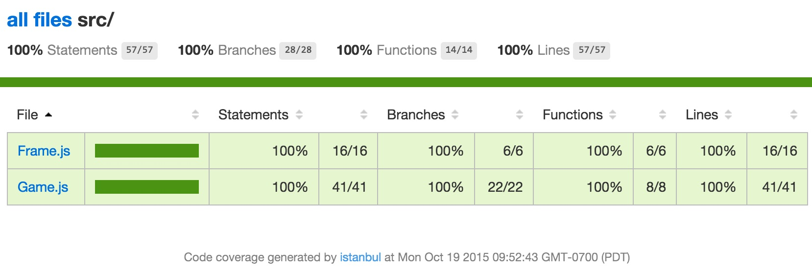
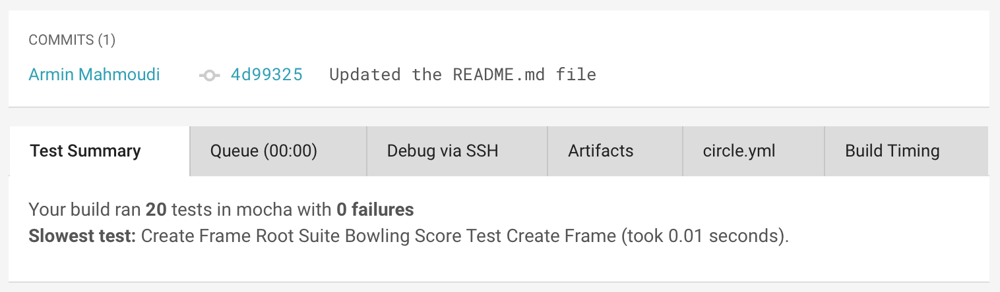
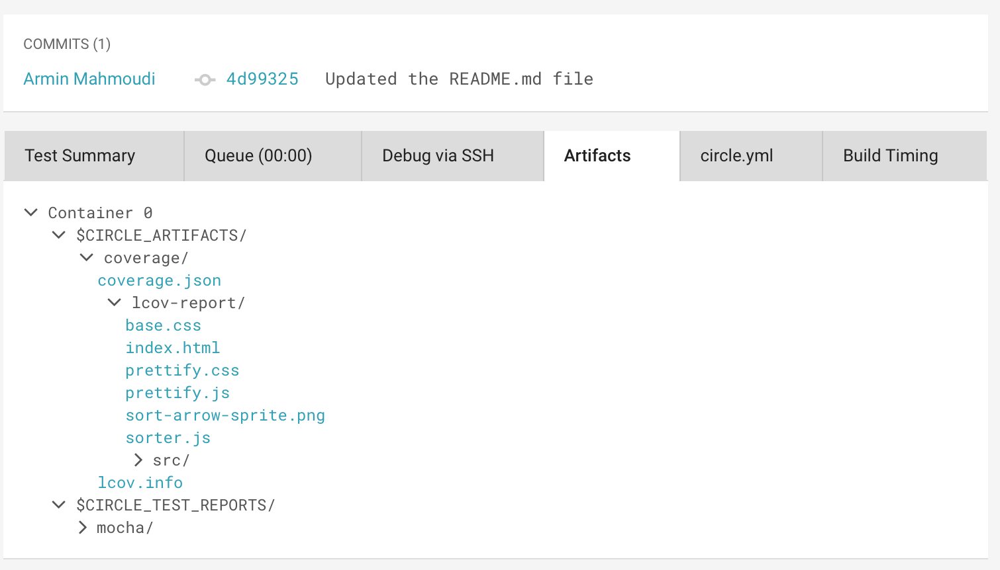

Continuous Integration [](https://circleci.com/gh/cmusv-fse/CI-CD)
==============
Continuous Integration and Deployment Recitation

Changelog
==============
1. Implementation of a bowling score card.
1. Reference for Unit Testing lab for FSE Fall 2015 at CMU-SV.
1. Updated for CircleCI Integration for FSE Spring 2018 at CMU-SV.
1. Updated for CI/CD recitation for FSE Spring 2019 at CMU-SV.
1. Updated for CI/CD recitation for FSE Fall 2019 at CMU-SV.

Install
==============
Install needed tools:
```
npm install -g grunt-cli mocha nyc

npm install
```

Tests results
==============
Run the Gruntfile with argument "test". This runs `mocha` behind the scenes.
```
grunt test
```

Coverage results
==============
* Option 1: Run the Gruntfile with argument `coverage`. This runs `nyc mocha` (with some optional flags) behind the scenes.
    ```
    grunt coverage
    ```

* Option 2: Tell `nyc` (Istanbul's CLI) to run `grunt test` and capture the results.
    ```
    nyc grunt test
    ```

The results with be in `coverage/lcov-report/index.html`



CircleCI integration
==============

1. Link your account with CircleCI by following 
["Getting Started with CircleCI"](https://circleci.com/docs/getting-started).
1. After the account is linked, when you push changes to the repo CircleCI will run your tests and code coverage.
1. You can see the results under `Test Summary` and `Artifacts > Coverage`.

### Test Summary



### Artifacts > Coverage


